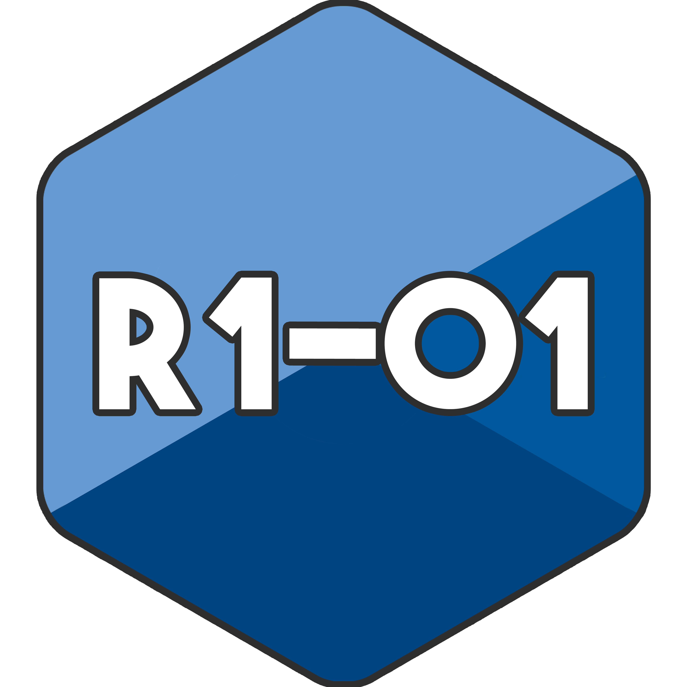

<p align="center>

    
# Code de la ressource R1.01
</p>

**Si vous avez de meilleurs solutions pour les exercices (ce qui est très probable ^^) n'hésitez pas à me faire une pull request !**

<br/>

---
## Compilation

Les programmes incluant la librairie commonthings.hpp doivent être complilés en conséquence. De ce fait, lors de l'édition des liens, il est nécessaire d'inclure `commonthing.o` tel que :

```bash
$ g++ -o output.app input.o ../../../includes/CommonThings/commonthings.o
```
Le reste des programme est à compiler normalement.

