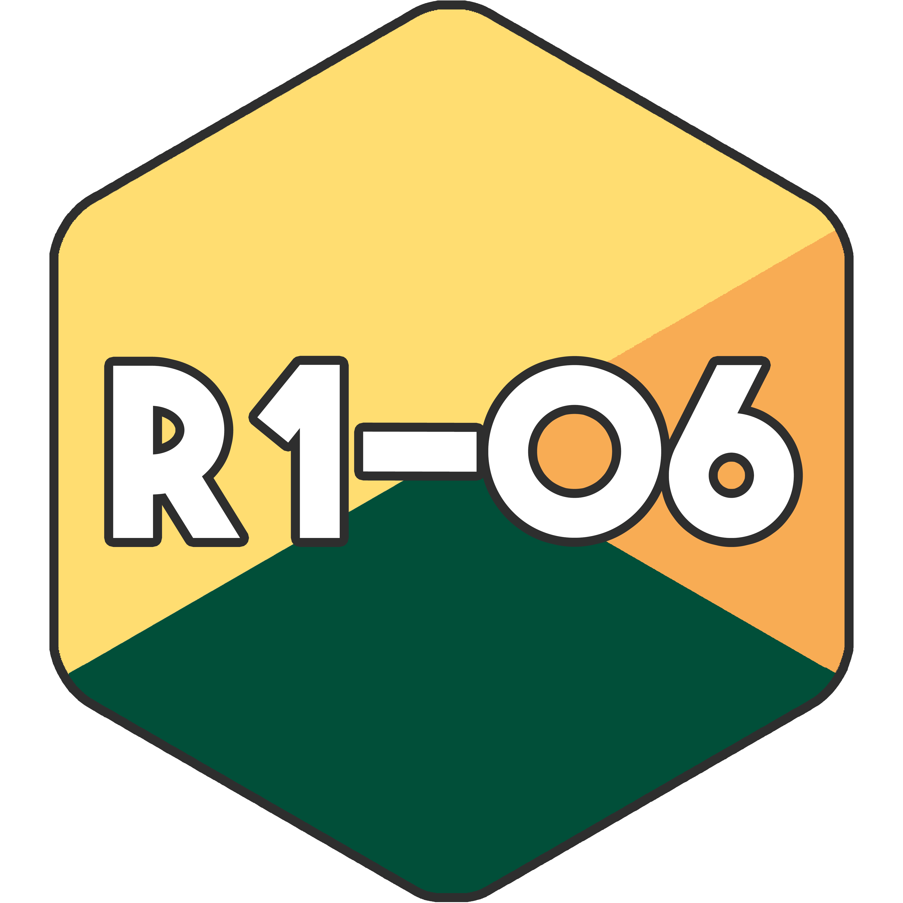

    
    <h1 align="center">Code de la ressource R1-06</h1>

**Toute pull request est la bienvenue**, j'accecpterai avec plaisir vos version des programmes demandés dans cette ressource.

 

---

Tous les TP présents dans cette ressource sont réalisés dans des notebook `jupyter` et requièrent l'utilisation de `sagemath`.